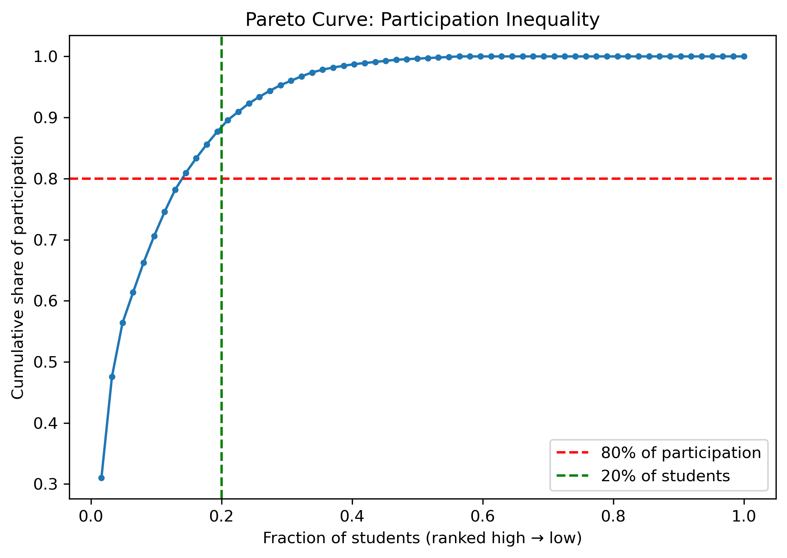
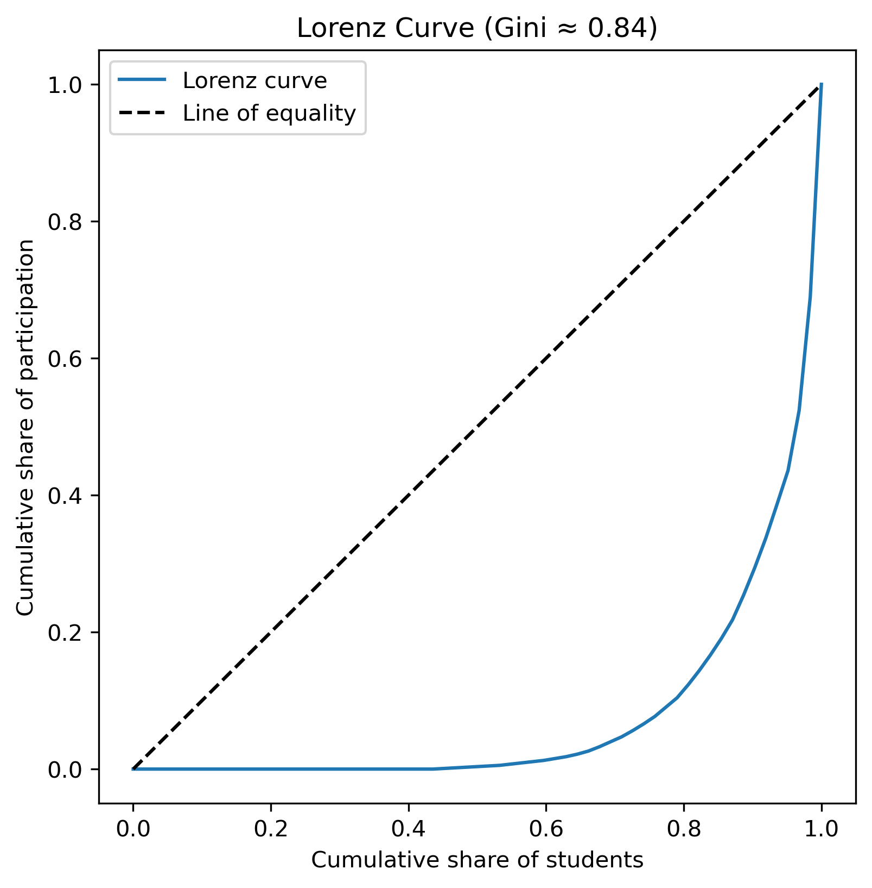

# 📊 80/20 Classroom Participation Analysis  

## 📌 Introduction  
This project investigates classroom participation inequality through the **80/20 principle**.  
Inspired by Richard Koch’s *80/20 Principle*, which suggests that 80% of outcomes often come from 20% of inputs, I wanted to test if classroom participation follows the same pattern.  

Over **82 hours**, I tracked participation across **62 students** and **4 subjects**, totaling 1105 participation.
What constitute as a participation ?
-> any voluntary intervention whether asking a question, answering a question, or participating in a debate

---

## 📂 Data  
- Data was collected manually  
- The dataset is anonymized, the ID have no relevant meaning

---

## 🛠️ Methods  
- **Data collection & cleaning**: Spreadsheets
- **Analysis & visualization**: Python (Pandas, NumPy, Matplotlib, Jupyter Notebooks)  
- **Metrics**: Distribution of participation, Pareto analysis, Lorenz curve, Gini coefficient  

---

## 📈 Results  

### Histogram of Student Totals  
Most students participated less than 10 times, while a small group contributed much more.  

  

---

### Pareto Curve (Overall)  
We see the **80/20 effect**, even more inequal: roughly **15% of students account for 80% of participation** or **20% of students account for 90% of participation**

  

---

### Lorenz Curve & Gini Coefficient  
The Gini coefficient of **0.84** confirms strong inequality in participation.  

  

---

### Participation by Subject  
Some subjects show higher participation than others, with **Subject_1** leading and **Subject_2** lowest.  

  

---

## 📝 Conclusion  
- Participation is **not equal**.  
- A minority of students consistently dominate classroom discussions.  
- This project validates that the **80/20 rule applies in classroom participation**.  

---

## ⚙️ Reproducibility  
To reproduce the analysis:  

```bash
git clone https://github.com/yourusername/classroom-participation-8020.git
cd classroom-participation-8020/notebooks
jupyter notebook participation_analysis.ipynb
